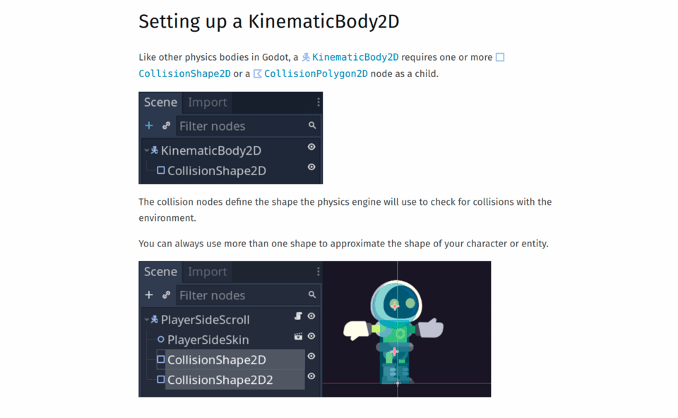

Nodes are central to Godot, but there is an *overwhelming* amount of them, with literally thousands of functions, many of which you won't need.

What if you could get a shortcut? Guides that teach you only the most valuable features and how to use them in your games?

These **free node essentials guides** are precisely that.

In this series, you'll get three complete node guides and Godot demos that cover the many ways to use:

- `KinematicBody2D`, the most commonly used node to code game characters.
- `RichTextLabel`, the one node for all your game dialogues.
- `AnimationPlayer`, which will save you countless lines of code.

You'll see how to push rocks and other obstacles as in 2D Zelda games.



You'll discover how to show information about a keyword on hover in dialogues with `RichTextLabel`.

You can use that for quests or a glossary.



You'll learn to sequence attack patterns with `AnimationPlayer`.



And so much more. Each guide covers the node's key features and ways to use it in games.



## Great guides for all Godot users

We designed the guides to help you learn the nodes as fast as possible.

The only **pre-requisite** is to have some experience with Godot and programming.

If you've worked with Godot for a while, you'll love the overview style that focuses only on the features and code snippets you need.

*Note* these node guides are not step-by-step tutorials.

Instead, they save you time by focusing on crucial code snippets and techniques to create specific game mechanics with Godot.

If you're new to Godot, you can start with our free five-hour course: [Getting Started with Godot in 2021]().

## What you'll get

Each guide follows the same format to help you learn each node quickly:

1. We start with a list of each node's key features, the ones you really want to know about.
1. Then, we cover how you can use that node in a real game with critical code snippets.
1. Finally, we answer your questions and share extra pro tips.

You'll get long, written guides, each with a dedicated Godot project to learn from.

<!-- Here's the full list of all the demos you'll get in this series: -->

<!-- TODO: list all the use cases from the guides? -->

## Get the free node guides

To get the free guides, click the button below and enter your email address. You'll get them over the next three days.



*No strings attached. You can unsubscribe anytime.*
